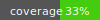

[](https://github.com/madagiurgiu25/decoil-pre/blob/main/LICENSE)

# Decoil

Decoil (deconvolve extrachromosomal circular DNA isoforms from long-read data) is a software package for reconstruction
circular DNA.

- [Getting started using conda and pip](#gettingstartedpip)
- [Getting started using docker or singularity](#gettingstarted)
- [Run example using docker or singularity](#testexample)
- [Run Decoil reconstruction using docker or singularity](#decoil-slim)
- [Install Decoil from source](#installsource)
- [Decoil configurations](#decoil-config)
- [File formats](#decoil-file)
- [FAQ](#decoil-faq)
- [Citation](#citation)
- [License](#license)

<a name="gettingstartedpip"></a> 

## Getting started using conda and pip

Assumes you have conda installed.

```bash
conda create -n envdecoil -c bioconda -c conda-forge python==3.10 survivor==1.0.7 sniffles==1.0.12 deeptools==3.5.5 ngmlr==0.2.7 samtools==1.15.1 python-dateutil==2.8.0
conda activate envdecoil
python -m pip install decoil==1.1.2

decoil --version
```

<a name="gettingstarted"></a>

## Getting started using docker or singularity

As a prequisite you need to have install `docker` or `singularity` (you can install this from the official website or using `conda`).

### 1.1 Download as docker image

Download `decoil` docker image from `docker-hub`. This contains all the dependencies needed to run the software. No additional installation needed. All the environment, packages, dependencies are all specified in the docker/singularity image. 


```bash
# docker
docker pull madagiurgiu25/decoil:1.1.2-slim
```

### 1.2 Download as singularity image

```bash
# singularity
singularity pull decoil.sif  docker://madagiurgiu25/decoil:1.1.2-slim
```

<br/>

<a name="testexample"></a> 

### 2. Run example using docker or singularity 

To test your installation check the [Example](docs/example.md).

<br/>

### 3. Run Decoil reconstruction using docker or singularity <a name="decoil-slim"></a> 

To run Decoil on your data you need to cofigure the following parameters:

```bash
# run decoil with your input with standard parameters
BAM_INPUT="<absolute path to your BAM file>"
OUTPUT_FOLDER="<absolute path to your output folder>"
NAME="<sample name>"
GENOME="<absolute path to your reference genome file>"
ANNO="<absolute path to your gtf annotation file>"
```

and then run the following command:

```bash
# docker
docker run -it --platform=linux/amd64 \
    -v ${BAM_INPUT}:/data/input.bam \
    -v ${BAM_INPUT}.bai:/data/input.bam.bai \
    -v ${GENOME}:/annotation/reference.fa \
    -v ${ANNO}:/annotation/anno.gtf \
    -v ${OUTPUT_FOLDER}:/mnt \
    -t madagiurgiu25/decoil:1.1.2-slim \
    decoil-pipeline sv-reconstruct \
            -b /data/input.bam \
            -r /annotation/reference.fa \
            -g /annotation/anno.gtf \
            -o /mnt --name ${NAME}
```

```bash
# singularity
mkdir -p ${OUTPUT_FOLDER}
mkdir -p ${OUTPUT_FOLDER}/logs
mkdir -p ${OUTPUT_FOLDER}/tmp
singularity run \
    --bind ${OUTPUT_FOLDER}/logs:/mnt/logs \
    --bind ${OUTPUT_FOLDER}/tmp:/tmp \
    --bind ${BAM_INPUT}:/data/input.bam \
    --bind ${BAM_INPUT}.bai:/data/input.bam.bai \
    --bind ${GENOME}:/annotation/reference.fa \
    --bind ${ANNO}:/annotation/anno.gtf \
    --bind ${OUTPUT_FOLDER}:/mnt \
    decoil.sif \
    decoil-pipeline sv-reconstruct \
            -b /data/input.bam \
            -r /annotation/reference.fa \
            -g /annotation/anno.gtf \
            -o /mnt --name ${NAME}
```

<br/>

<a name="installsource"></a> 

## Install Decoil from source

You can install the latest version of Decoil repository (git and conda/mamba required):

```
git clone https://github.com/madagiurgiu25/decoil-pre.git
cd  decoil-pre

# create conda environment
# for linux
mamba env create -f environment.yml
# for macos
mamba env create -f environment.yml --platform osx-64

conda activate envdecoil
python setup.py install
```

And check if the installation worked:

```
# might take a while
decoil-pipeline --version
decoil --version
```


<a name="decoil-config"></a><br/>

## Decoil configurations 

An overview about the available functionalities:

|                	| [decoil-pipeline](#decoil-pipeline)	| [decoil](#decoil-docs) | [decoil-viz](#decoil-viz) |
|----------------	|--------	|-----------------	|------------	|
|                	|  (recommended)	                    |  (advanced users)	     | (recommended)	           |
| SV calling     	| x       |                	 |            	|
| coverage track 	| x      	|                 	|            	|
| reconstruction 	| x      	| x               	|            	|
| visualization  	|        	|                 	| x          	|
| docker         	| x      	| x               	| x          	|
| singularity    	| x      	| x               	| x          	|


<a name="decoil-pipeline"></a> <br/>

### 1. Reconstruct ecDNA using `decoil-pipeline` (recommended)

To reconstruct ecDNA we recommend to use `decoil-pipeline` using the `sv-reconstruct` mode.<br/>
This requires only a `.bam` file as input and generates internally all the files required for the reconstruction.


```bash
# call help
docker run -it --platform=linux/amd64 -t madagiurgiu25/decoil:1.1.2-slim decoil-pipeline --help

usage: decoil-pipeline <workflow> <parameters> [<target>]
Example: 
    # run decoil including the processing and visualization steps
    decoil-pipeline -f sv-recontruct --bam <input> --outputdir <outputdir> --name <sample> --sv-caller <sniffles> -r <reference-genome> -g <annotation-gtf>
        

Decoil 1.1.2: reconstruct ecDNA from long-read data

positional arguments:
  {sv-only,sv-reconstruct,reconstruct-only}
                        sub-command help
    sv-only             Perform preprocessing
    sv-reconstruct      Perform preprocessing and reconstruction

optional arguments:
  -h, --help            show this help message and exit
  --version             show program's version number and exit
  -n, --dry-run
  -f, --force
  -c, --use-conda
```

The pipeline has the following [running modes](docs/decoil_pipeline_modes.md):

- `sv-only`
- `sv-reconstruct`
- `reconstruct-only`

<a name="decoil-viz"></a><br/>

### 2. Visualization of ecDNA threads using `decoil-viz` (recommended)

To interpret and visualize the results of the ecDNA reconstruction threads, use [decoil-viz](https://github.com/madagiurgiu25/decoil-viz).

<a name="decoil-docs"></a><br/>

### 3. Reconstruct ecDNA using `decoil` (advanced users only)

This configuration is the most flexible and allows users to use their own SV calls. For details go [here](docs/decoil_reconstruct.md).

<a name="#decoil-faq"></a><br/>

## FAQ

Check recommendations for filtering or debugging in the [FAQ](docs/faq.md) section.

<a name="decoil-file"></a><br/>

## File formats

The relevant output files for the users are:

- `reconstruct.bed` - contains all genomic fragments composing all reconstructions
- `reconstruct.ecDNA.bed` - contains all genomic fragments composing all the ecDNA labeled reconstructions
- `summary.txt` - summarize all the circular reconstructions

```bash
cat reconstruct.bed

#chr    start   end     circ_id fragment_id     strand  coverage        estimated_proportions
chr2    15585356        15633376        0       5       +       149     75
chr3    11150000        11160001        0       41      -       103     75
chr3    11049997        11060001        0       33      +       117     75
chr2    15585356        15633376        3       5       +       149     36
chr3    11150000        11160001        3       41      -       103     36
chr3    11049997        11060001        3       33      +       117     36
chr2    15585356        15633376        3       5       +       149     36
chr2    16521052        16628305        3       13      +       37      36
chr3    10981202        11028470        3       25      -       31      36
chr12   68807722        68970910        2       53      +       252     252

```

```bash
cat summary.txt

circ_id chr_origin      size(MB)        label   topology_idx    topology_name   estimated_proportions
0       chr3,chr2       0.068025                4       multi_region_inter_chr  75
3       chr3,chr2       0.270566        ecDNA   5       simple_duplications     36
2       chr12           0.163188        ecDNA   0       simple_circle           252
```

<br/>

<a name="citation"></a>

## Citation

If you use Decoil for your work please cite our paper:

Madalina Giurgiu, Nadine Wittstruck, Elias Rodriguez-Fos, Rocio Chamorro Gonzalez, Lotte Bruckner, Annabell Krienelke-Szymansky, Konstantin Helmsauer, Anne Hartebrodt, Philipp Euskirchen, Richard P. Koche, Kerstin Haase*, Knut Reinert*, Anton G. Henssen*.
**Reconstructing extrachromosomal DNA structural heterogeneity from long-read sequencing data using Decoil**. _Genome Research 2024_, DOI: [https://doi.org/10.1101/gr.279123.124](https://doi.org/10.1101/gr.279123.124)


```
@article{Giurgiu2024ReconstructingDecoil,
    title = {{Reconstructing extrachromosomal DNA structural heterogeneity from long-read sequencing data using Decoil}},
    year = {2024},
    journal = {Genome Research},
    author = {Giurgiu, Madalina and Wittstruck, Nadine and Rodriguez-Fos, Elias and Chamorro Gonzalez, Rocio and Brueckner, Lotte and Krienelke-Szymansky, Annabell and Helmsauer, Konstantin and Hartebrodt, Anne and Euskirchen, Philipp and Koche, Richard P. and Haase, Kerstin and Reinert, Knut and Henssen, Anton G.},
    month = {8},
    pages = {gr.279123.124},
    doi = {10.1101/gr.279123.124},
    issn = {1088-9051}
}
```

Paper repository: [https://github.com/henssen-lab/decoil-paper](https://github.com/henssen-lab/decoil-paper)

## License <a name="license"></a> 

Decoil is distributed under the BSD 3-Clause license.  Consult the accompanying [LICENSE](LICENSE) file for more details.

## Disclaimer

Decoil and the content of this research-repository (i) is not suitable for a medical device; and (ii) is not intended
for clinical use of any kind, including but not limited to diagnosis or prognosis.

